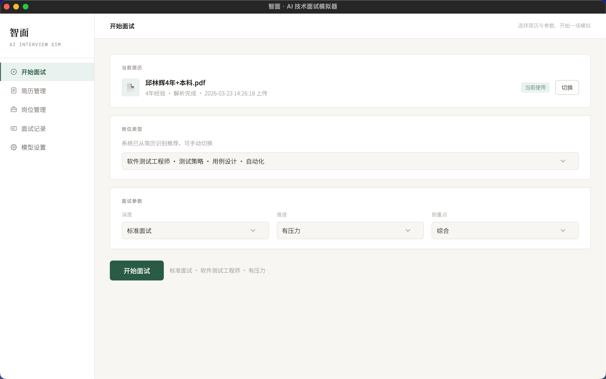
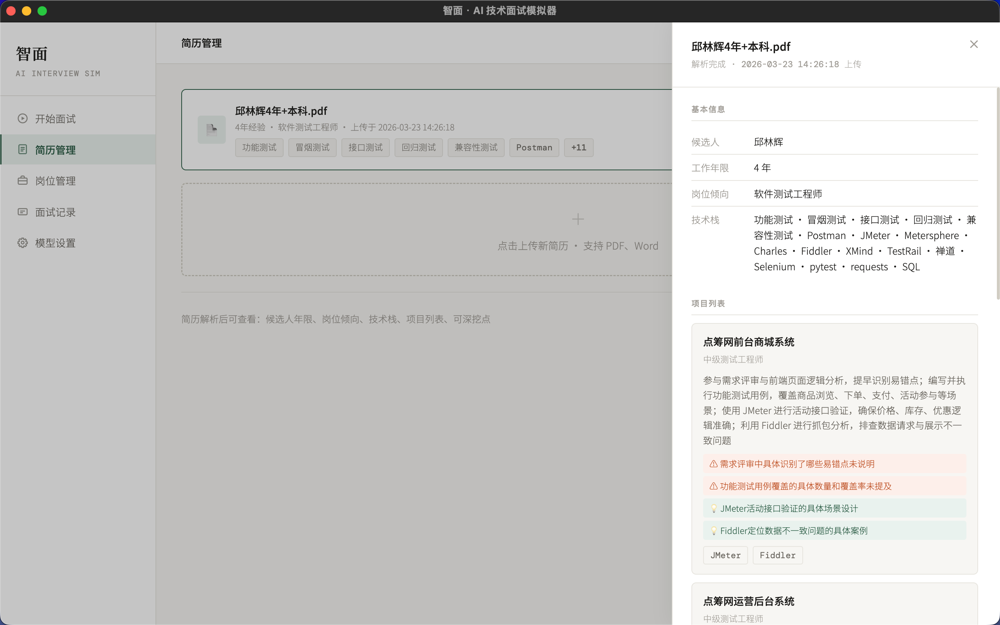
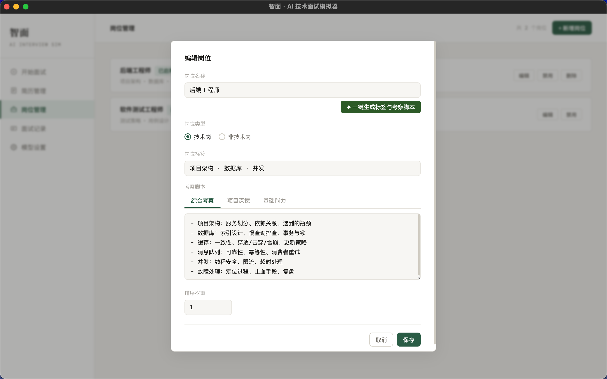
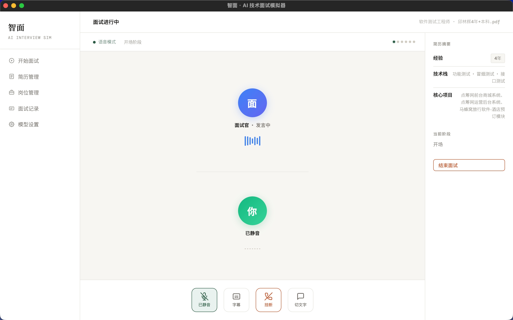
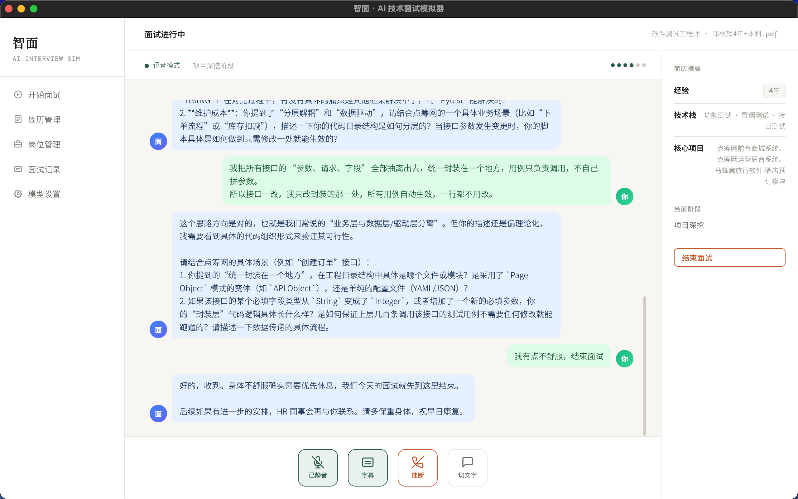
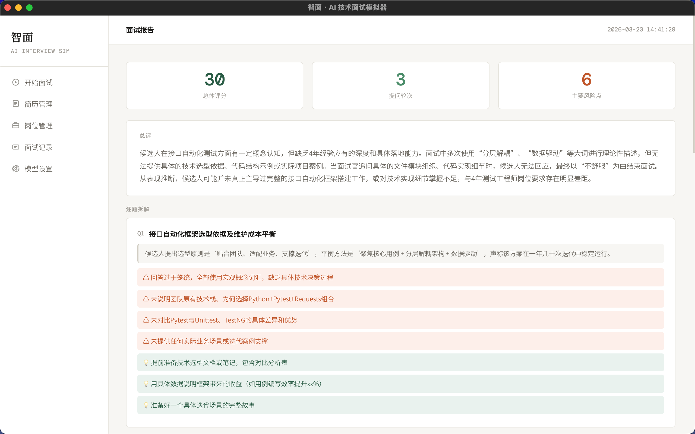
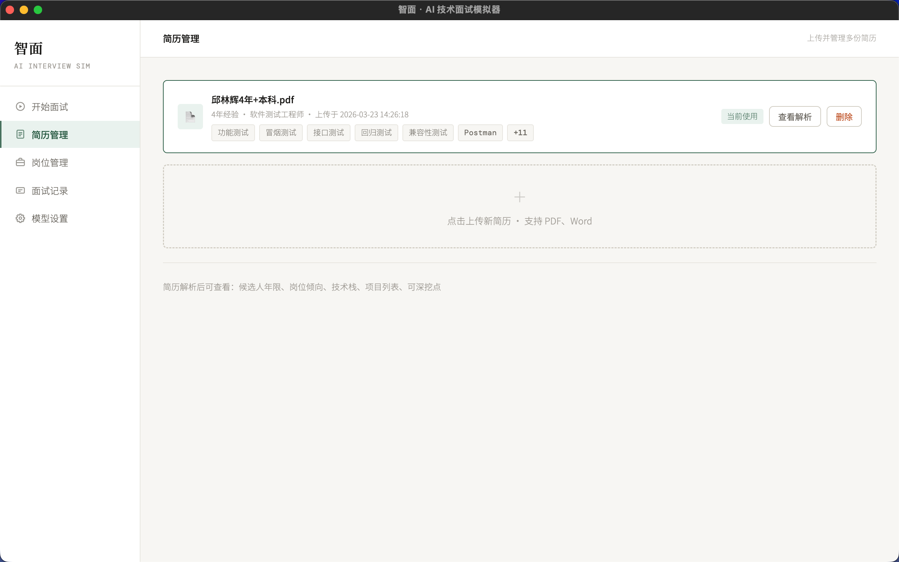
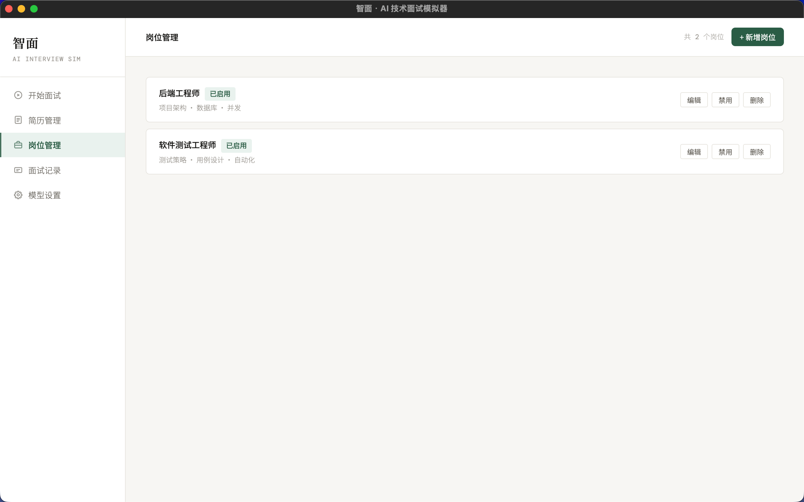
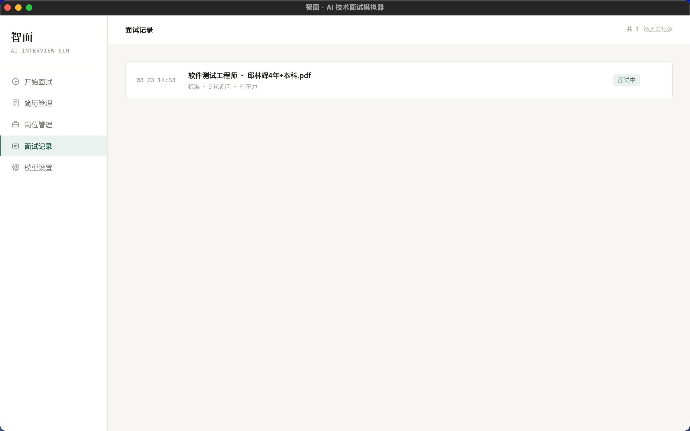
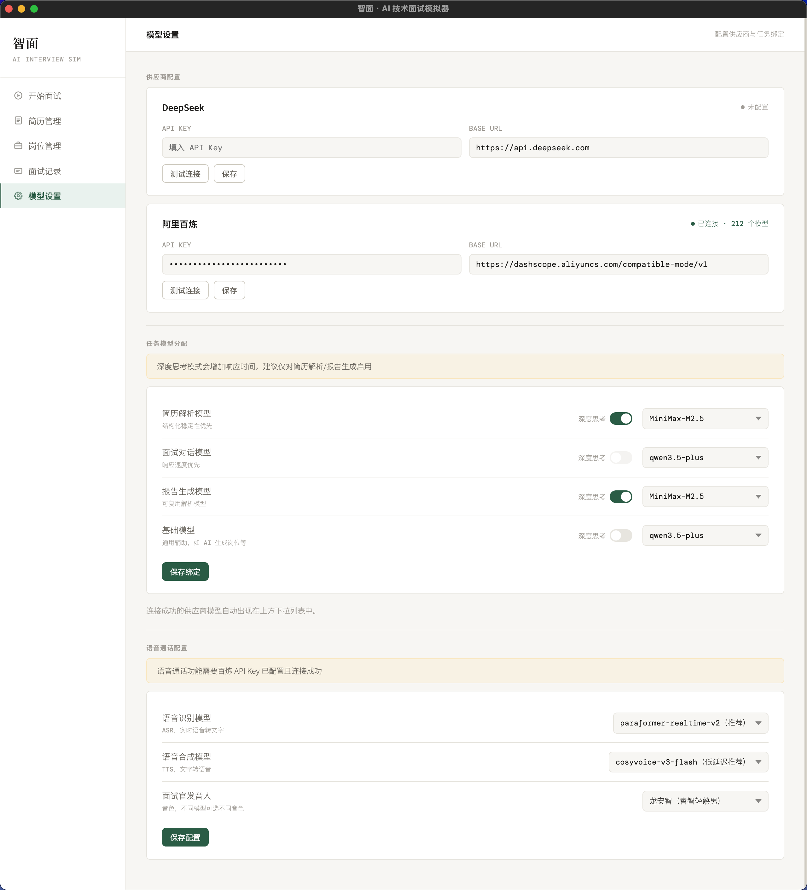

<h1 align="center">
  <br>
  智面 · GrillMind
  <br>
</h1>

<h4 align="center">🎤 AI 技术面试模拟器 — 上传简历，选择岗位，AI 面试官即刻上线</h4>

<p align="center">
  <a href="https://github.com/1935417243/GrillMind/releases/latest">
    
  </a>
  <a href="https://github.com/1935417243/GrillMind/releases">
    
  </a>
  <a href="https://github.com/1935417243/GrillMind/stargazers">
    
  </a>
  <a href="LICENSE">
    
  </a>
</p>

<p align="center">
  <a href="#-下载安装">下载安装</a> •
  <a href="#-功能亮点">功能亮点</a> •
  <a href="#-界面预览">界面预览</a> •
  <a href="#-使用指南">使用指南</a> •
  <a href="#-常见问题">常见问题</a>
</p>

<p align="center">
  
</p>

---

## 🚀 下载安装

**无需安装 Node.js 或任何开发环境**，下载即用：

<table>
  <tr>
    <th>平台</th>
    <th>下载链接</th>
    <th>安装方式</th>
  </tr>
  <tr>
    <td>🍎 macOS (Apple Silicon)</td>
    <td><a href="https://github.com/1935417243/GrillMind/releases/latest"><code>GrillMind-*.dmg</code></a></td>
    <td>双击 <code>.dmg</code> → 拖入「应用程序」文件夹</td>
  </tr>
  <tr>
    <td>🪟 Windows x64</td>
    <td><a href="https://github.com/1935417243/GrillMind/releases/latest"><code>GrillMind-Setup-*.exe</code></a></td>
    <td>双击 <code>.exe</code> → 一路下一步</td>
  </tr>
</table>

> 💡 **首次打开提示**
> - **macOS**：如遇安全警告，前往「系统设置 → 隐私与安全性」中允许打开
> - **Windows**：如遇 SmartScreen 警告，点击「更多信息 → 仍要运行」

<p align="center">
  <a href="https://github.com/1935417243/GrillMind/releases">
    
  </a>
</p>

---

## ✨ 功能亮点

<table>
  <tr>
    <td width="50%">

**📄 简历智能解析**
上传 PDF / Word 简历，AI 自动提取候选人信息、技术栈、项目列表及可深挖点

**🎯 岗位考察脚本**
自定义岗位或 AI 一键生成考察脚本，覆盖综合考察 / 项目深挖 / 基础能力三种侧重

**💬 AI 面试对话**
基于简历与岗位脚本，多轮追问、深度挖掘，还原真实面试

**🎙️ 实时语音通话**
集成阿里百炼 ASR + TTS，面试官语音提问，实时字幕同步

  </td>
  <td width="50%">

**📊 面试评估报告**
面试结束自动生成评分报告：总评 · 逐题拆解 · 风险标注 · 改进建议

**⚙️ 多供应商模型接入**
支持 DeepSeek / 阿里百炼等多供应商，按任务独立绑定模型，可选深度思考模式

**🔄 文字 / 语音自由切换**
面试中可随时在文字对话与语音通话之间无缝切换

**🖥️ 跨平台桌面应用**
Electron 打包，macOS / Windows 开箱即用，CI 自动构建发布

**🔒 数据本地存储**
所有简历、面试记录、报告等数据均存储在本地 SQLite，无需担心隐私泄露

  </td>
  </tr>
</table>

---

## 📸 界面预览

<table>
  <tr>
    <td align="center"><br/><b>📄 简历智能解析</b><br/><sub>自动提取候选人信息、技术栈与可深挖点</sub></td>
    <td align="center"><br/><b>🎯 AI 一键生成岗位脚本</b><br/><sub>输入岗位名即可生成三套考察脚本</sub></td>
  </tr>
  <tr>
    <td align="center"><br/><b>🎙️ 语音面试模式</b><br/><sub>面试官语音提问，实时互动</sub></td>
    <td align="center"><br/><b>💬 实时字幕 + 文字对话</b><br/><sub>语音与文字无缝切换，完整记录对话</sub></td>
  </tr>
  <tr>
    <td colspan="2" align="center"><br/><b>📊 面试评估报告</b><br/><sub>总体评分 · 逐题拆解 · 风险标注 · 改进建议</sub></td>
  </tr>
</table>

<details>
<summary>📖 更多界面导览（点击展开）</summary>
<br>

| 页面 | 预览 |
|:----:|------|
| **开始面试** |  |
| **简历管理** |  |
| **岗位管理** |  |
| **面试记录** |  |
| **模型设置** |  |

</details>

---

## ⚡ 使用指南

```
配置模型 → 上传简历 → 选择岗位 → 开始面试 → 查看报告
```

| 步骤 | 操作 | 说明 |
|:----:|------|------|
| 1️⃣ | **配置模型** | 进入「模型设置」，填入供应商 API Key 并测试连接，为各任务绑定模型 |
| 2️⃣ | **上传简历** | 在「简历管理」中上传 PDF / Word 简历，系统自动解析提取信息 |
| 3️⃣ | **管理岗位** | 在「岗位管理」中新增岗位，或使用 **AI 一键生成**考察脚本 |
| 4️⃣ | **开始面试** | 选择简历与岗位参数（深度 / 难度 / 侧重点），点击开始 |
| 5️⃣ | **面试交互** | 文字对话或切换语音通话模式，AI 面试官多轮追问深挖 |
| 6️⃣ | **查看报告** | 面试结束自动生成评估报告，含评分与改进建议 |

> 💡 **Tip**：语音通话功能需要配置**阿里百炼** API Key 并测试连接成功

---

## 🛠️ 技术栈

| 层 | 技术 |
|:---:|------|
| **前端** | React 19 · Vite 8 · React Router 6 |
| **后端** | Fastify 4 · better-sqlite3 |
| **语音** | 阿里百炼 ASR（Paraformer）· TTS（CosyVoice） |
| **AI 模型** | OpenAI 兼容协议（DeepSeek / 阿里百炼 / 自定义） |
| **桌面端** | Electron · electron-builder · GitHub Actions CI |

---

## 📁 项目结构

```
GrillMind/
├── frontend/              # React 前端
│   └── src/
│       ├── pages/         # 页面（开始面试、简历管理、岗位管理等）
│       ├── components/    # 组件（侧边栏、语音通话、聊天气泡等）
│       ├── api/           # API 客户端
│       └── store/         # 全局状态管理
├── backend/               # Fastify 后端
│   └── src/
│       ├── routes/        # API 路由
│       ├── services/      # 业务逻辑
│       ├── ai/            # AI 调用封装
│       └── db/            # SQLite 数据库
├── electron/              # Electron 主进程
└── .github/workflows/     # CI 自动构建
```

<details>
<summary>🔧 开发者本地运行（点击展开）</summary>

#### 前置要求

- **Node.js** ≥ 18
- 至少一个 AI 供应商的 **API Key**（DeepSeek 或 阿里百炼）

#### 安装与启动

```bash
# 1. 克隆项目
git clone https://github.com/1935417243/GrillMind.git
cd GrillMind

# 2. 安装依赖
npm install
cd backend && npm install && cd ..
cd frontend && npm install && cd ..

# 3. 初始化数据库
npm run db:init

# 4. 启动开发服务
npm run dev
```

启动后访问 http://localhost:5173 即可使用。

#### 本地打包桌面端

```bash
npm run electron:build:mac   # macOS
npm run electron:build:win   # Windows
```

</details>

---

## ❓ 常见问题

<details>
<summary><b>macOS 提示「应用已损坏，无法打开」？</b></summary>
<br>

由于 macOS 的安全机制，非 App Store 下载的应用可能会触发此提示。在终端执行以下命令即可修复：

```bash
sudo xattr -rd com.apple.quarantine "/Applications/GrillMind.app"
```

</details>

<details>
<summary><b>需要哪些 API Key？</b></summary>
<br>

| 功能 | 所需供应商 | 说明 |
|------|-----------|------|
| 面试对话 / 简历解析 / 报告生成 | DeepSeek **或** 阿里百炼 | 至少配置一个即可使用核心功能 |
| 语音通话（ASR + TTS） | 阿里百炼 | 语音面试功能必需 |

**🔑 API Key 申请地址：**
- **阿里百炼**：[bailian.console.aliyun.com](https://bailian.console.aliyun.com/cn-beijing/?spm=5176.29619931.J_SEsSjsNv72yRuRFS2VknO.2.74cd10d7Gq6QTi&tab=model#/model-market)
- **DeepSeek**：[platform.deepseek.com](https://platform.deepseek.com/api_keys)

</details>

---

## 📄 开源协议

[MIT](LICENSE) — 自由使用、修改与分发
